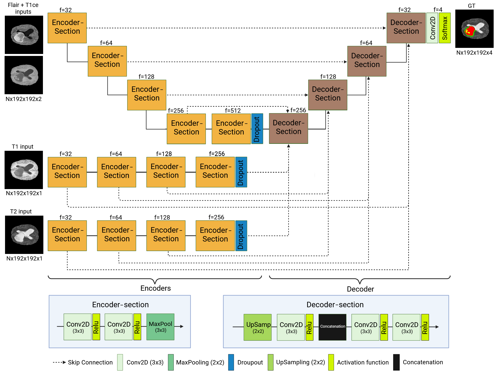
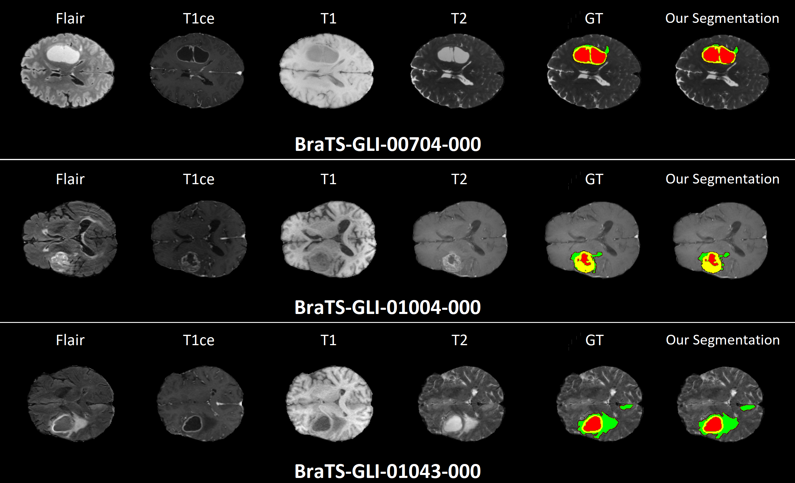

# Multi-Encoder U-Net for Brain Tumor Segmentation

This repository contains the implementation of a Multi-Encoder U-Net for multimodal 3D brain tumor segmentation using BraTS 2023 dataset.

## Folder Structure

- `requirements.txt` : Python libraries needed
- `get_data_from_synapse.py` : download and extract dataset from Synapse
- `metrics.py` : dice coefficients and evaluation metrics
- `datagenerator.py` : custom Keras data generator
- `unet_model.py` : multi-encoder U-Net model
- `main_notebook.ipynb` : main workflow, visualization, and training
- `README.md` 

## Dataset Access (BraTS 2023)
The BraTS 2023 dataset is hosted on the **Synapse platform**:
https://www.synapse.org/

To access the dataset:
1. Create a Synapse account
2. Request access to the BraTS 2023 challenge
3. Download the data using your credentials or a generated API token

## Model Architecture
This project uses a multi-encoder U-Net architecture designed for multimodal brain MRI segmentation. Each encoder processes a different MRI modality independently, allowing the network to learn modality-specific features before fusing them in a shared decoder. This design improves robustness and segmentation accuracy compared to single-encoder approaches.

## Segmentation Examples
Below are qualitative segmentation results produced by the trained model on validation samples. The predictions are visualized slice-wise alongside the corresponding MRI modalities to highlight how the model captures tumor structures across different regions and tissue types.

